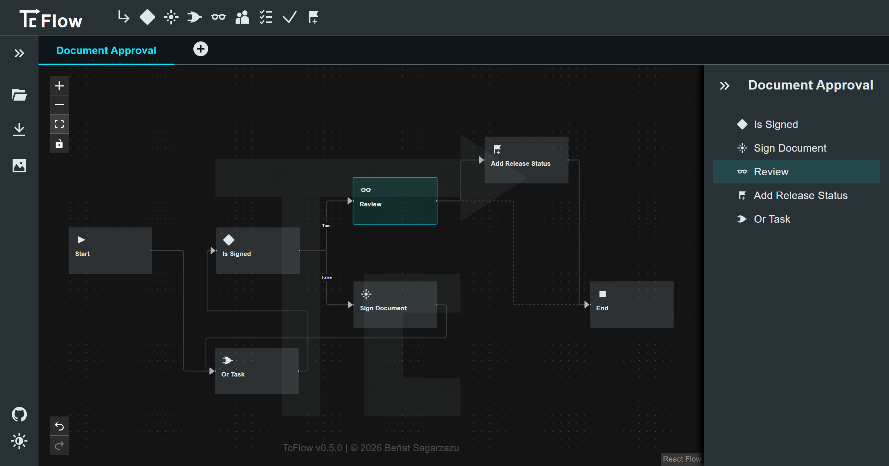

# <picture></picture>

Web-based Teamcenter workflow editor built with [Siemens iX](https://github.com/siemens/ix) and [React Flow](https://github.com/xyflow/xyflow).

<picture></picture>

## Features

- **Workflow editor**: Edit multiple workflows, managing tasks, handlers and arguments.
- **Independent**: Edit workflows without needing a Teamcenter environment.
- **Interoperability**: Export & import PLMXML files for Teamcenter.
- **Rich saving**: Export & import workflows as `.tcflow` JSON files.
- **Privacy-first**: Your workflows don't leave your browser.
- **PWA support**: Works fully offline.
- **Productivity**: Full undo & redo support.
- **Image support**: Download your workflows as PNG or SVG.
- **Themes**: Dark and light mode support.
- **Free & open-source**: Licensed under AGPLv3.

> **Note**: As a beta release, TcFlow is expected to have multiple bugs, mainly related to the PLMXML interoperability, as well as the following limitations:
>
> - PLMXML files containing multiple workflows are not yet supported.
> - At the moment, only True and False condition values are supported for condition tasks.

## Reporting Bugs & Feature Requests

Please [create an Issue](https://github.com/bsagarzazu/tcflow/issues/new) if you found a bug or want to request a new feature.

I include the features I plan to add in the [Backlog Milestone](https://github.com/bsagarzazu/tcflow/milestone/8). Expressing your interest in them by reacting to the corresponding Issue might lead me to implement them first.

> **Note**: TcFlow is a personal project. While I plan to actively maintain it and fix bugs, PRs are currently not accepted. Please open an issue to discuss any ideas first.

## Sponsors & Support

If you find this tool useful in your daily work, consider [becoming a sponsor](https://github.com/sponsors/bsagarzazu).

## Companies using TcFlow

I would love to hear if you are using TcFlow at your organization! Let me know to feature your company [here](https://www.linkedin.com/in/bsagarzazu/).

## License

TcFlow is licensed under the [AGPLv3 License](LICENSE), which means that any modifications must be open source and shared under the same license.

If your company requires using TcFlow without these open-source restrictions, [contact me for a commercial license](https://www.linkedin.com/in/bsagarzazu/).
